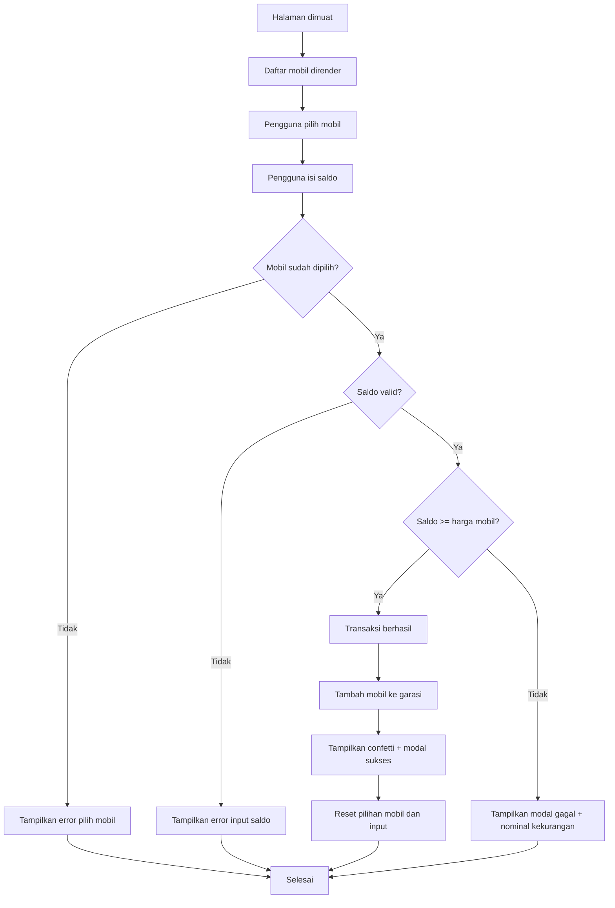

```mermaid
flowchart TD
    A[Halaman dimuat] --> B[Daftar mobil dirender]
    B --> C[Pengguna pilih mobil]
    C --> D[Pengguna isi saldo]
    D --> E{Mobil sudah dipilih?}
    E -- Tidak --> E1[Tampilkan error pilih mobil] --> Z[Selesai]
    E -- Ya --> F{Saldo valid?}
    F -- Tidak --> F1[Tampilkan error input saldo] --> Z
    F -- Ya --> G{Saldo >= harga mobil?}
    G -- Ya --> H[Transaksi berhasil]
    H --> I[Tambah mobil ke garasi]
    I --> J[Tampilkan confetti + modal sukses]
    J --> K[Reset pilihan mobil dan input]
    K --> Z
    G -- Tidak --> L[Tampilkan modal gagal + nominal kekurangan]
    L --> Z
```
